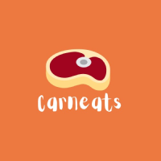
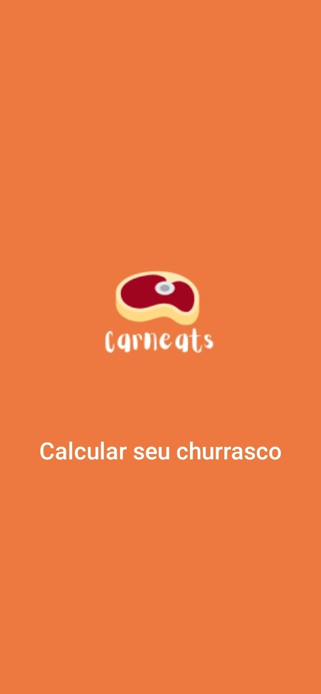
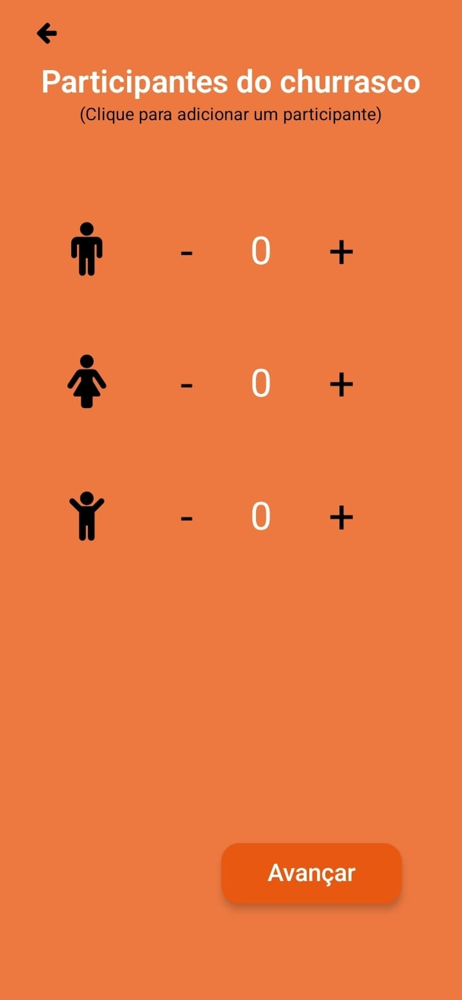
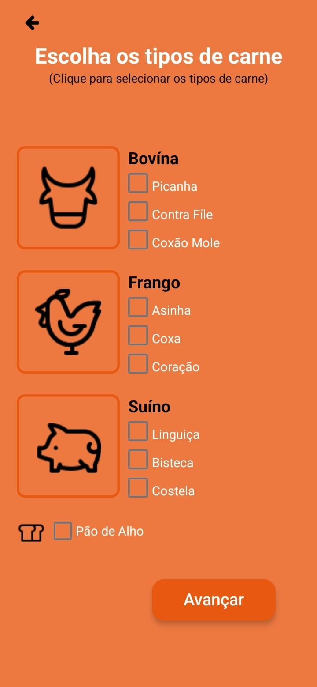
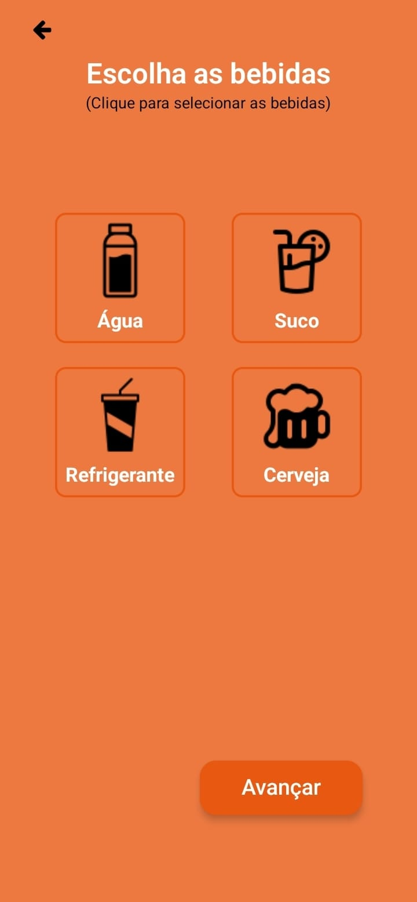
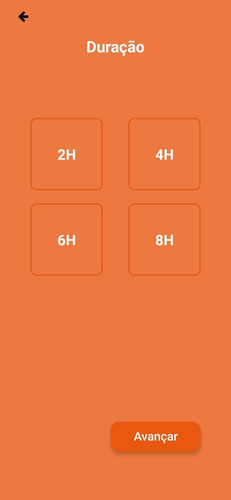
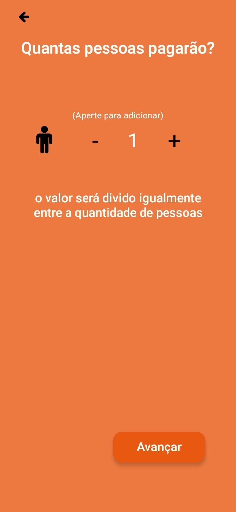
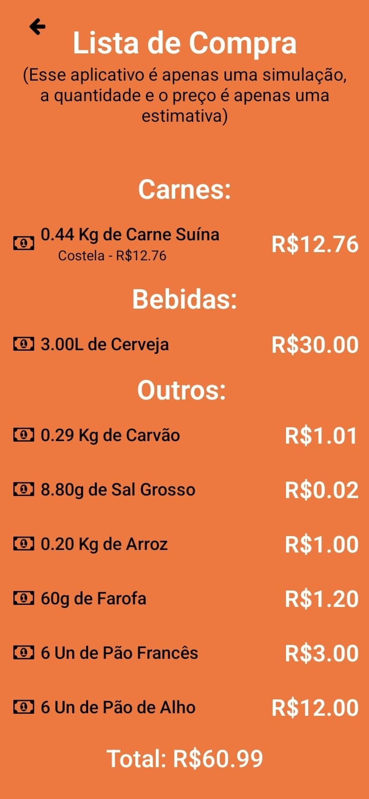
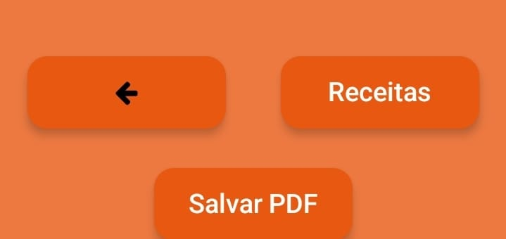
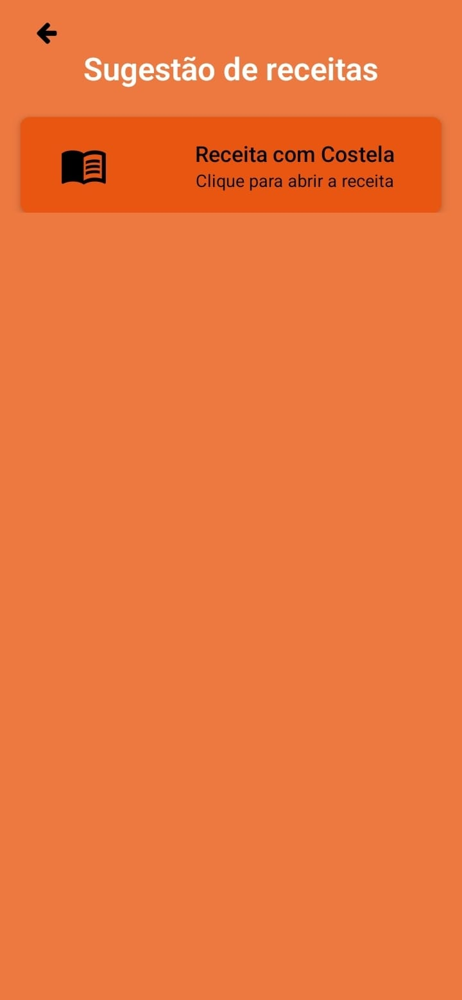

##  Carneats  
Aplicativo criado com o Expo que calcula o seu churrasco

<p align="center">
  <a href="#-tecnologias">Tecnologias</a>&nbsp;|&nbsp;
  <a href="#-projeto">Projeto</a>&nbsp;|&nbsp;
  <a href="#-layout">Layout</a>
</p>

## 🚀 Tecnologias

Esse projeto foi desenvolvido com as seguintes tecnologias:

- React Native   `Versão:0.69.6`
- JavaScript     `Versão:EC6`
- Node           `Versão:16.6.1`
- Expo           `Versão:46.0.16`


## 💻 Projeto

O Carneats calcula a quantidade de carne e bebida necessária para um churrasco a partir da quantidade de pessoas que serão convidadas pelo usuario.

## 🔖 Layout

#### Tela inicial

Aperte `"Calcular seu churrasco"` para começar a calcualar.

<p align="center">
  
</p>


#### Tela de Participantes

Escolha a quantidade de pessoas para seu churrasco.

<p align="center">
  
</p>

#### Tela de Carnes

Escolha os tipos de carne boniva, suína ou frango.

<p align="center">
  
</p>

#### Tela de Bebidas

Escolha as bebidas que estarão presentes.

<p align="center">
  
</p>

#### Tela de Duração

Escolha quanto tempo irá durar seu churrasco.

<p align="center">
  
</p>

#### Tela de Rateio

Escolha quantas pessoas vão pagar.

<p align="center">
  
</p>

#### Tela de Localização

Indique o Cep do local do churrasco e clique para mostrar os açougues próximos.

<p align="center">
  
</p>    

#### Tela de Resultado

Essa tela exibe a quantidade e o valor detalhadamente de cada item para o seu churrasco.

<p align="center">
  
</p>    
<p align="center">
  
</p>    


#### Tela de Receitas

Essa tela possue sugestões de receitas de acordo com o tipo de carne que escolheu.

<p align="center">
  
</p>    


### [`Clique aqui para vizualizar o prototipo do projeto`](https://www.figma.com/file/EIKrn5JYGKPcrU7wpZckb4/Figma?node-id=0%3A1)

## :memo: Rodando a aplicação

Instale as dependências com [](https://docs.npmjs.com/getting-started):

```
$ npm install 
```

Teste o aplicativo no seu celular usando o expo:

```
$ expo start 
```

---

Feito com ♥ by Carneats :wave:
